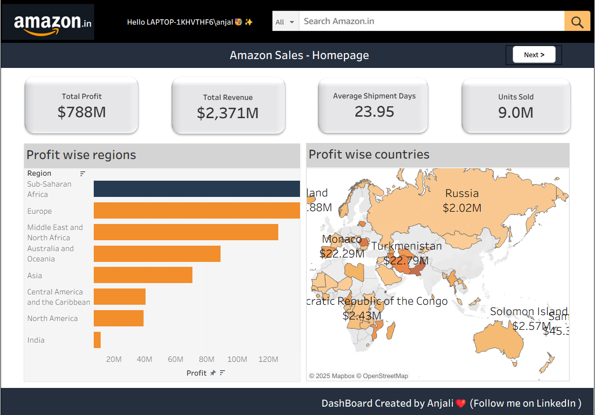

# 📊 Amazon Sales Analysis Dashboard

This is a Tableau dashboard built to analyze and visualize Analyse the profit by region & countries ,channel revenue analysis,etc.

---

## ✨ Key Insights

- 🔹 Analyse the profit by region & countries
- 🔹 Channel revenue analysis
- 🔹 Number of orders per year
- 🔹 Number of orders per priority
- 🔹 Shipments by priority
- 🔹 Average revenue accross year
- 🔹 Items wise revenue , profit margins ,shipments, number of units sold
---

## 📸 Dashboard Preview

---

## 🌐 Live Interactive Dashboard

[🔗 View it on Tableau Public]([https://public.tableau.com/views/YourDashboardLinkHere](https://public.tableau.com/app/profile/anjali.jaisinghani7365/viz/AmazonSalesAnalysisDashboard_17536335797360/ItemAnalysis?publish=yes))

---

## 📁 Files Included

- Amazon-sales-Analysis-Dashboard.twbx
- dashboard.png
---

## 🛠 Tools Used

- Tableau Public
- Amazon Sales data_Amazon Sales data

## 🎥 Inspired by this [YouTube tutorial](https://www.youtube.com/watch?v=b-DUlYzMIdA&t=4898s) to learn Tableau dashboarding.

